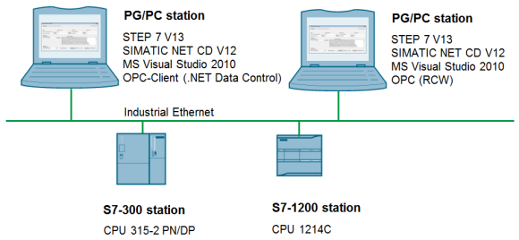
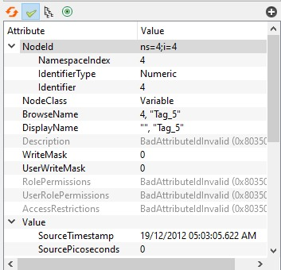

# OPC Client
OPC is a software interface standard that allows Windows programs to communicate with industrial hardware devices.



```csharp
// READ
var strNodeIds = new string[]
{
    "ns=4;i=3",
    "ns=4;i=4"
};
var values = tmpOpcUaClient.ReadValues(strNodeIds);
```



The OPC client software is any program that needs to connect to the hardware, such as an HMI . The OPC client uses the OPC server to get data from or send commands to the hardware.
